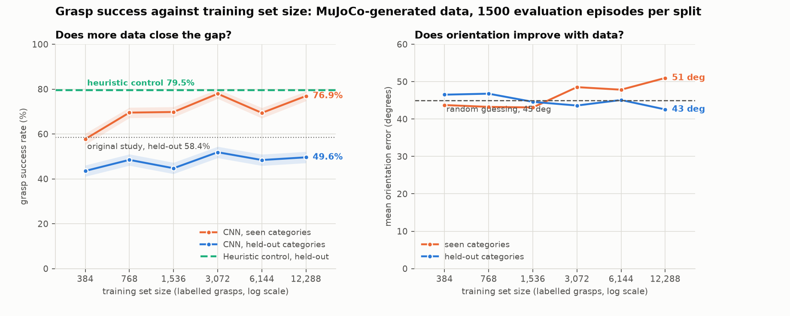

# Isaac grasp scaling

**Does a grasping network's orientation failure survive more data, or was 15,000
samples simply too few?**

A follow-up to [Simulated-grasping](https://github.com/abyyworld/Simulated-grasping),
where a fully-convolutional grasp-quality network trained on self-supervised
grasp attempts in MuJoCo **lost to a hand-written depth heuristic** on unseen
objects, 58.4% against 75.3%. An ablation traced the cause to the network
learning grasp *position* but not grasp *orientation*: mean angle error against
the oracle was 47.2 degrees on held-out shapes, worse than the 45 degrees of a
random guess.

The obvious objection is that the dataset was too small. That objection is
testable. This repository ports the task to NVIDIA Isaac Lab, which runs
thousands of environments in parallel on one GPU, regenerates the dataset at
much larger scale, retrains the same architecture, and plots success against
training set size.

Either answer publishes. If more data closes the gap, the original negative
result is explained. If it does not, the failure is architectural, which is a
sharper claim than the original made.

---

<!-- RESULTS -->
## Results



### The control, re-run unchanged

The heuristic does not depend on training data, so it is the check that the environment still is what it was. It is the first number to read.

| | this run | original study |
|---|---|---|
| Heuristic, held-out categories | **79.5%** (n=1500, 95% CI 77.3% to 81.4%) | 75.3% (n=89) |
| Heuristic, seen categories | 90.5% (n=1500) | 88.3% (n=111) |

**The original's held-out control was underpowered.** Its 75.3% came from 89 held-out trials, a 95% interval of roughly 65% to 83%. Measured here on 1500 trials of the same scenes with the same unchanged policy, it is 79.5%. The two are consistent, but they are not the same number, and the bar the learned policy has to clear is the more precise one.

### The curve, on MuJoCo-generated data

Same architecture, same training loop, 12 epochs at 112 px at every point. Training subsets are nested and the validation set is fixed, so a difference between points is added data and nothing else.

| training scenes | labelled grasps | seen | held-out | gap | angle error (held-out) |
|---|---|---|---|---|---|
| 128 | 384 | 57.7% | 43.5% | 14.2 pp | 46.5 deg |
| 256 | 768 | 69.5% | 48.5% | 21.1 pp | 46.8 deg |
| 512 | 1,536 | 69.8% | 44.7% | 25.1 pp | 44.6 deg |
| 1,024 | 3,072 | 77.9% | 51.9% | 26.1 pp | 43.6 deg |
| 2,048 | 6,144 | 69.4% | 48.4% | 21.0 pp | 45.1 deg |
| 4,096 | 12,288 | 76.9% | 49.6% | 27.3 pp | 42.6 deg |

n = 1500 evaluation episodes per split, on the original held-out scenes, giving a 95% interval of about plus or minus 2.5 points on each. The trend is the readable part, not any single pair of adjacent points.

### What the curve says

Over a 32x range in training data, fitting rate against log2(samples):

| quantity | slope per doubling | 95% interval | r-squared |
|---|---|---|---|
| Seen-category success | +2.96 pp | -0.49 to +6.41 | 0.59 |
| Held-out success | +1.06 pp | -0.70 to +2.83 | 0.41 |
| Held-out orientation error | -0.74 deg | -1.39 to -0.08 | 0.71 |

Seen-category success rises. Held-out success is **consistent with flat**: its 95% interval runs from -0.70 to +2.83 points per doubling, which contains zero. The useful half of that is the upper end. Whatever gain more data buys on unseen shapes, over this range it is **at most 2.83 points per doubling**, and closing the 30 point distance to the heuristic at that rate would take about 11 further doublings. Held-out success moved from 43.5% to 49.6% against the heuristic's 79.5%, and the gap between seen and held-out went from 14.2 to 27.3 points.

**Orientation error is falling, and this is the one trend the data resolve.** It drops 0.74 degrees per doubling of training data, 95% interval 0.08 to 1.39, which excludes zero. More data does improve orientation.

The rate is what settles the question. From 42.6 degrees, reaching the 35.2 degrees the original study achieved on seen categories after its contrastive-label fix would take about 10 further doublings at the fitted rate, and about 5 even at the fastest end of the interval. That is between 39x and 1,008x the 12,288 grasps used here: of order 0.5 million to 12 million labelled grasps. The lower end of that is reachable with a GPU simulator. The upper end is not an experiment anyone is going to run, and it is the reason to suspect the architecture rather than the dataset.

Falling is not the same as good. Held-out orientation error goes from 46.5 degrees to 42.6 across the whole 32x range, against the 45 a random guess scores. It never gets more than 2.4 degrees away from chance at any size measured.

The seen-category figure does not resolve at all (43.7 degrees at the smallest size, 51.0 at the largest, wandering in between). It is scored on only 59 grasps per point against 167 for held-out, because the determinacy filter removes the rotationally symmetric shapes and most of the training categories are symmetric. That scatter is the measurement, not the model, and it is why the held-out figure is the one quoted.

The sharper measurement is the **bin spread**: the range of predicted grasp quality across the twelve gripper angles at the pixel the network chose. It falls from 0.41 to 0.07 across the curve. The first value is an undertrained network's noise rather than real angle sensitivity, so the reading is that the network's quality estimate becomes progressively **less** sensitive to how the gripper is turned as it sees more data, settling near the 0.070 the original measured at roughly 27,000 samples. Predicting the angle-marginal success rate is a minimum of this loss, and more data finds it more reliably.

### Where the scatter comes from

Two things move a point off the line, and they call for different fixes.

| source | standard deviation |
|---|---|
| Evaluation, binomial at n=1500 per split | 1.29 pp |
| Training, at a fixed dataset size | 2.33 pp |
| Total scatter about the fit | 2.66 pp |

**Training noise dominates.** The evaluation term is known exactly from the episode count; the training term is what is left, and covers initialisation, data order and augmentation draws at a fixed dataset size. At 200 episodes per split the evaluation term was 3.53 points and dominated; at 1500 it no longer does, so more episodes would now be wasted money and the next spend belongs on repeated runs or more sizes.

It is worth putting that next to the trend: retraining the same size moves held-out success by about 2.3 points, and doubling the data moves it by 1.06. The run-to-run noise is larger than the effect being measured, which is the honest reason this curve is hard to resolve and not a matter of needing a bigger simulator.

### What this arm does not settle

**It tops out below the study it follows up.** The largest point here is 12,288 labelled grasps. The original trained on roughly 27,000 and reported 58.4% held-out, which is above every point on this curve. So the curve evidently continues upward past where this arm reached, and nothing here shows that more data cannot help. What it shows is that across a 32x range the held-out gap did not close and orientation did not leave chance.

Reaching the original's scale, and the one to two orders of magnitude beyond it that the Isaac Lab port exists to make affordable, is the experiment this arm sets up rather than the one it performs. The Isaac backend has not been run.

Full tables in [docs/results.md](docs/results.md); the raw numbers are in `results/scaling/` as JSON and CSV.
<!-- /RESULTS -->

---

## Status: what has been run, and what has not

This matters more than usual here, so it is at the top rather than buried.

| | status |
|---|---|
| MuJoCo control arm: collect, train, evaluate, curve | **run, numbers below** |
| Heuristic baseline, re-run unchanged | **run** at n=1500; 79.5% held-out, consistent with but more precise than the original's 75.3% at n=89 |
| Object catalogue translation to USD | **tested** (48 tests, no GPU needed) |
| Oracle grasp, success criterion, batched collector | **tested against the originals** |
| Isaac Lab backend, its own logic | **executed** against a stub Isaac API |
| Isaac Lab backend, in contact with the real simulator | **never executed** |

169 tests, all passing without a GPU.

The Isaac Lab backend was written on a machine with no NVIDIA GPU, where Isaac
Sim cannot be installed. `src/isaacgrasp/backends/isaac_backend.py` carries that
status banner in its own docstring, and a test fails if the banner is removed.

Those are two different doubts and they are worth separating.
`tests/fakes/isaac.py` supplies stub `isaaclab`, `isaacsim`, `omni.usd` and
`pxr` modules, and 26 tests drive the backend against them. That does not
validate the real API: the stubs were written from the same understanding that
wrote the backend, so a shared misunderstanding survives both. It does mean the
backend's own arithmetic has been run and checked, including the pieces that
fail silently rather than loudly, such as the 103.4 mm offset between the grasp
point and the hand body.

`scripts/check_setup.py --isaac` is the gate. It exercises the backend in six
named stages and reports which one fails, because the useful question on a fresh
GPU box is not "does it work" but "which of the six things it needs is missing".

---

## Quick start

```bash
make install
make assets         # Franka Panda MJCF, ~33 MB, from a pinned Menagerie commit
make check          # verifies the install by running it, not by reading it
make test
```

Then, on CPU, the control arm:

```bash
make collect  BACKEND=mujoco SCENES=6000 DATA=data/mj18k
make scaling  DATA=data/mj18k OUT=results/scaling/mujoco
```

On a rented RTX box, the Isaac arm (see [docs/setup-cloud.md](docs/setup-cloud.md)):

```bash
bash scripts/setup_cloud.sh --check     # refuses a GPU with no RT cores
bash scripts/setup_cloud.sh
python scripts/check_setup.py --isaac   # the gate. Read its output.
make collect BACKEND=isaac SCENES=200000 NUM_ENVS=1024 DATA=data/isaac600k
```

### Where to get a GPU

The two stages want different machines, and splitting them is what keeps this
affordable:

* **Dataset generation** needs an RTX-class GPU with working Vulkan and about
  30 GB of disk. A spot RTX 4090 on Vast.ai or RunPod is a few dollars for the
  whole run. GCP's free trial and the GitHub Student Pack's Azure credit both
  cover it.
* **Training** is ordinary PyTorch and runs free on Kaggle's T4 x2, which is 30
  hours a week. [`notebooks/kaggle_scaling.ipynb`](notebooks/kaggle_scaling.ipynb)
  is ready to run: attach your dataset, set the accelerator, go. That is where the
  settings the original study said it needed and could not afford belong, namely
  30 epochs at 224 px with ImageNet initialisation.
* **Kaggle cannot run Isaac Sim.** Its P100 has no RT cores at all; its T4 has
  them but is not on NVIDIA's supported list, and the session disk and 12-hour
  limit sit badly against a 30 GB install that does not persist.
* **The MuJoCo control arm and every evaluation** are CPU only.

Full detail, including the exact provisioning steps, in
[docs/setup-cloud.md](docs/setup-cloud.md).

---

## How the comparison is kept honest

The entire value of this project is that only one thing changed. That is
enforced mechanically, not promised.

**Nothing simulator-independent is reimplemented.** The network, the training
loop, the loss, the dataset format, the augmentation, the grasp sampler, the
heuristic baseline and the evaluation statistics are imported from `simgrasp` at
a commit pinned in `pyproject.toml`. There is no copy of any of them here, so
none of them can drift.

**What cannot be imported is checked numerically.** `isaacgrasp.parity` records
the 22 constants the port must reproduce, from the table height and the camera
field of view to the 0.08 m lift that defines success, and fails loudly if the
upstream definitions move. The manifest is written into every dataset and every
result file, so a number can be traced to the definitions it was produced under
without trusting this README.

**Three pieces are pinned by test rather than by import:**

| piece | test | why |
|---|---|---|
| the oracle grasp restated from episode state | `test_oracle_view.py` | it is the centre of the label distribution |
| the success criterion | `test_outcome_classification.py` | it defines what every number counts |
| the batched collector | `test_collect.py` | it must reproduce the original byte for byte |

The last one is the strongest: it runs the original collector and the batched one
over the same episodes and compares the images, the labels and the outcomes byte
for byte. That is what makes the throughput comparison a comparison of
simulators rather than of two separately-tuned pipelines.

**The control is re-run, never quoted.** The heuristic does not depend on
training data, so it should reproduce the original study exactly. It is the
first number in the results below for that reason: if it had come out different,
something in the environment had moved and every other number here would be
suspect.

**Training subsets are nested and the validation set is fixed.** Every point on
the curve validates on the same held-out 600 scenes, and the training set at
each size is a prefix of the next, so the curve measures added data rather than
a different draw.

---

## Separating "more data" from "different simulator"

Training on Isaac-generated data and evaluating in MuJoCo would confound two
variables. The design keeps them apart:

* **Evaluation always happens in MuJoCo**, on the original held-out scenes
  (`EVAL_EPISODE_OFFSET = 1_000_000`), against the original unchanged heuristic.
  Every number is directly comparable to the original study's.
* **A MuJoCo arm of the same curve** varies scale inside one simulator, with no
  sim-to-sim gap at all. That is the arm reported below.
* **A control point at the original scale.** If the Isaac arm at the same sample
  count reproduces the MuJoCo arm within the confidence interval, the simulator
  is not the confound and the rest of the Isaac curve is interpretable. If it
  does not, the Isaac curve measures scale plus a sim-to-sim gap and has to be
  reported that way.

---

## Repository layout

```
src/isaacgrasp/
  parity.py            the 22 constants the port must reproduce, and the check
  bootstrap.py         render backend selection, and the OSMesa/Triton guard
  collect.py           backend-agnostic dataset generation
  scaling.py           the experiment: train at each size, evaluate, measure angle
  angle.py             orientation error, the metric the question turns on
  plot.py              the committed curve
  throughput.py        samples per hour, read from what the collector recorded
  backends/
    base.py            the interface, the oracle, the success criterion
    mujoco_backend.py  batch of one over the original environment
    isaac_backend.py   NEVER EXECUTED. Read its status banner.
    isaac_scene.py     NEVER EXECUTED. The USD scene.
    isaac_objects.py   catalogue translation; pure geometry, fully tested

scripts/               one CLI per stage; all take --help
docs/design.md         decisions, the confound, the fallback plan
docs/setup-cloud.md    which GPU to rent, and what runs free
docs/results.md        generated from the artefacts by scripts/make_report.py
results/               committed JSON and CSV
```

---

## Two bugs found by running rather than reading

**The predecessor repository could not import itself.** Its `.gitignore` carried
an unanchored `data/` pattern for the generated dataset directory at the
repository root. Git applies an unanchored pattern at every level, so it also
matched `src/simgrasp/data/`, and that package was excluded from all 31 commits.
A fresh clone failed at import: no dataset, no training, no test suite. Local
runs and CI both passed, because both ran against a working tree that still had
the files. The package is gone from history, so it was reconstructed from the
committed callers and the committed tests; all 205 upstream tests pass against
the reconstruction. Fixed in
[abyyworld/Simulated-grasping#claude/restore-data-package](https://github.com/abyyworld/Simulated-grasping/tree/claude/restore-data-package).

**This repository segfaulted on its first real test run.** MuJoCo's OSMesa
software renderer and the Triton compiler bundled in the CUDA PyTorch wheel each
load their own LLVM, and whichever loads second kills the process with no
traceback. `isaacgrasp.bootstrap` loads torch and Triton before any GL context
exists. Importing torch alone is not enough, because torch loads Triton lazily
and the clash just moves.

Both repositories now carry `tests/test_repo_integrity.py`, which fails if any
source file becomes gitignored or any package `__init__.py` goes untracked. A
normal test suite cannot catch that, because it runs against the working tree
rather than against what was committed.

---

## Credits and licence

MIT licensed, see [LICENSE](LICENSE).

Built on [Simulated-grasping](https://github.com/abyyworld/Simulated-grasping),
which supplies the environment, the network and the evaluation. The Franka Emika
Panda model comes from
[MuJoCo Menagerie](https://github.com/google-deepmind/mujoco_menagerie),
Apache-2.0, fetched at a pinned commit and not vendored.
[Isaac Lab](https://github.com/isaac-sim/IsaacLab) is BSD-3-Clause.
